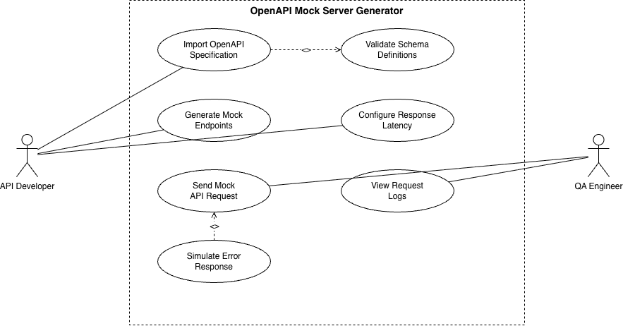

# Software Engineering - Semester 5

This repository contains my Software Engineering laboratory work for Semester 5.

## Labs

### Lab 1 - Requirements Specification and UML Use-Case Diagram

**Project:** OpenAPI Mock Server Generator

Contents:
- Requirements Specification
- Functional Requirements
- Non-Functional Requirements
- UML Use-Case Diagram
- Use-Case Description

[View Lab 1 Submission](LAB-1_PES2UG24AM041.pdf)

